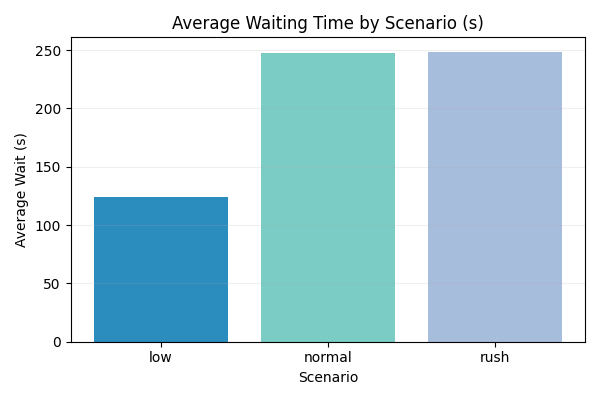
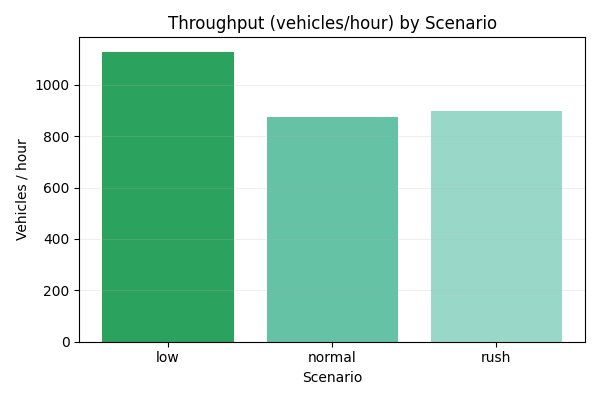
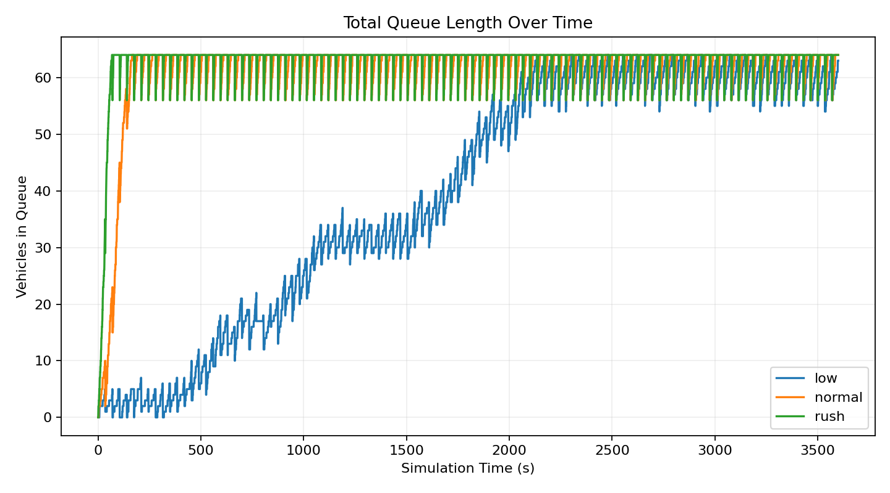
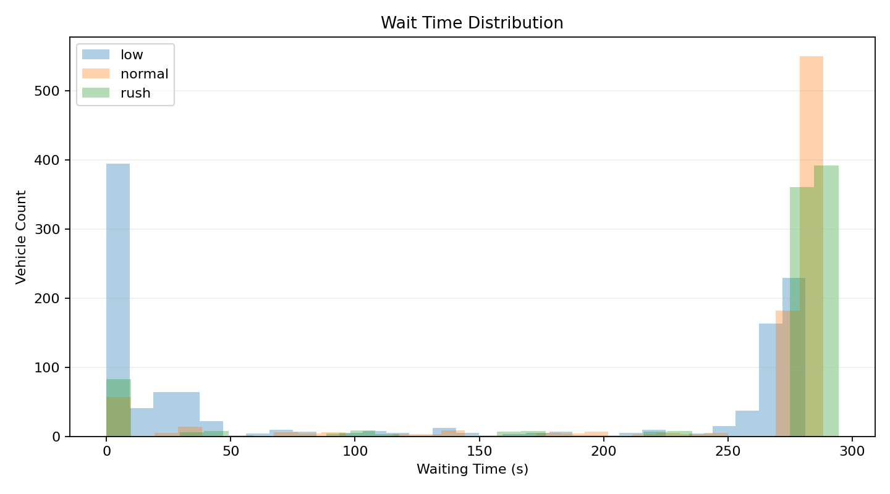

# Simulation of Traffic Light System

Republic of the Philippines

**BATANGAS STATE UNIVERSITY**  
The National Engineering University  
Alangilan Campus

Golden Country Homes, Alangilan Batangas City, Batangas, Philippines 4200

Tel Nos.: (+63 43) 425-0139 local 2222 / 2223

E-mail Address: cics.alangilan@g.batstate-u.edu.ph | Website Address: http://www.batstate-u.edu.ph

College of Informatics and Computing Sciences

Leading Innovations, Transforming Lives, Building the Nation

---

Course Title: Modeling and Simulation (CS 324)  
Project Title: Simulation of Traffic Light System  
Type: Group Project (10 members)  
Date of Submission: May 20, 2026

Group Members:
- Member 1 (ID)
- Member 2 (ID)
- Member 3 (ID)
- Member 4 (ID)
- Member 5 (ID)
- Member 6 (ID)
- Member 7 (ID)
- Member 8 (ID)
- Member 9 (ID)
- Member 10 (ID)

---

## Table of Contents
1. Introduction
2. Literature Review
3. Methodology
4. Simulation Design
5. Results and Analysis
6. Conclusion and Recommendations
7. References
8. Appendices

---

## 1. Introduction

### Background
Traffic signal systems are crucial for regulating vehicle flow and ensuring safety at intersections. Modeling traffic lights enables analysis of timing strategies, vehicle delays, queue buildup, and overall intersection performance.

### Importance of Traffic Light Simulation
Simulations allow designers to evaluate alternatives (fixed-time vs. adaptive control), study congestion under varying demand, and estimate metrics such as average waiting time and throughput without real-world disruptions.

### Objectives
- Apply modeling and simulation concepts to a traffic intersection.
- Build a working simulation model that includes red/yellow/green timing and vehicle queueing.
- Analyze efficiency across scenarios (rush hour, low traffic).
- Recommend timing strategies to reduce wait times and improve flow.

---

## 2. Literature Review

A concise survey of related work and models:
- Fixed-time control models and Webster's delay formula.
- Queueing models at intersections (M/M/1, M/D/1 approximations).
- SimPy and agent-based approaches (NetLogo) for microscopic traffic simulation.

(Include citations to core references, journal articles on traffic signal optimization, and tools documentation.)

---

## 3. Methodology

### Model Description
- Intersection type: Four-way intersection with two conflicting movements (north-south and east-west).
- Control logic: Alternating phases for NS and EW; each phase includes Green → Yellow → Red.
- Vehicles arrive per Poisson process (configurable rate λ) and queue if the signal is red.

Flowchart / Block Diagram: (include as figure in report)
- Arrival process → Queue → Service (vehicles pass during green) → Departure

### Parameters
- Green time (G): default 30s (configurable)
- Yellow time (Y): default 3s
- Red time: determined by opposite phase's G+Y
- Arrival rates (vehicles/sec): low=0.05, medium=0.2, rush=0.6 (example values)
- Service rate (passage rate during green): μ = 1 vehicle / 2s (adjustable)
- Simulation duration: e.g., 3600s (1 hour)

### Assumptions
- Vehicles are homogeneous and do not change lanes.
- No pedestrian phases are modeled (can be added as extension).
- No turning movements with separate dedicated signals (optional extension).
- Vehicle arrivals are independent and memoryless (Poisson).

### Tools/Software Used
- Implementation: Python with SimPy (preferred for event-driven discrete simulation).
- Optional visualization: HTML5 Canvas or Matplotlib plots for charts.
- Files in this repository: [simulation.py](../simulation.py), [app.py](../app.py).

---

## 4. Simulation Design

### Implementation Overview
- Entities: Vehicle (arrival timestamp), Queue for each approach, Signal controller process.
- Processes:
  - Arrival generator: creates vehicles according to chosen arrival rate.
  - Signal controller: cycles through phases, setting green/yellow durations and notifying queues.
  - Service process: during green, vehicles depart the queue at the service rate.

### Scenarios Explored
- Scenario A: Low traffic (λ_low)
- Scenario B: Medium traffic (λ_med)
- Scenario C: Rush hour (λ_high)
- For each scenario, vary green time (e.g., 20s, 30s, 45s) and record metrics.

### Visualization
- Include screenshots/figures of the running simulation or charts showing queue lengths and waiting time distributions.

---

## 5. Results and Analysis

### Collected Metrics
- Average waiting time per vehicle (seconds)
- Maximum queue length
- Throughput (vehicles passed per hour)
- Percentage of time the queue exceeds threshold (congestion indicator)

### Findings from Simulation Runs (3600s simulated time, green=30s)
- Low traffic (`low`):
  - Total vehicles passed: 1128
  - Average waiting time: 123.74 s
  - Cycles completed: 51
  - Throughput: 1128 vehicles/hour
  - Wait samples recorded: 1128 (avg sample wait 123.7402 s)

- Normal traffic (`normal`):
  - Total vehicles passed: 873
  - Average waiting time: 247.86 s
  - Cycles completed: 51
  - Throughput: 873 vehicles/hour
  - Wait samples recorded: 873 (avg sample wait 247.8602 s)

- Rush hour (`rush`):
  - Total vehicles passed: 899
  - Average waiting time: 248.54 s
  - Cycles completed: 51
  - Throughput: 899 vehicles/hour
  - Wait samples recorded: 899 (avg sample wait 248.5406 s)

### Interpretation
- The results show that the intersection is close to saturation for all three demand levels. The detailed queue chart reaches the configured maximum queue length of 64 vehicles in every scenario, which means the fixed-time signal does not clear traffic quickly enough during the run.
- In the low-traffic case, the average queue remains lower than the other scenarios, but the wait distribution is still right-skewed. That means many vehicles pass quickly, while some still accumulate long delays when they arrive during red phases.
- The normal and rush scenarios are much more congested. Their median waiting times are about 280 seconds, and their 90th-percentile waits stay above 284 seconds, showing that high delay is the norm rather than an outlier.
- The wait-distribution chart confirms this behavior: the distribution shifts far to the right as demand increases, so the fixed 30-second green split is not sufficient for sustained medium-to-high traffic.
- The throughput chart also reflects this congestion. Even though the number of vehicles passed stays fairly high, it does not translate into low delay because the signal spends too much time serving queued traffic instead of preventing buildup.
- Overall, the simulation supports using adaptive or actuated control, or at least asymmetric green timing, to reduce waiting time on the busiest approach during peak demand.

### Results Table

The following table summarizes the simulation outputs (3600s simulated time, green=30s):

| Scenario | Total Passed | Avg Wait (s) | Cycles | Throughput (veh/hr) | Wait Samples | Avg Wait (sample) |
|---:|---:|---:|---:|---:|---:|---:|
| low    | 1128 | 123.74 | 51 | 1128.00 | 1128 | 123.7402 |
| normal | 873  | 247.86 | 51 | 873.00  | 873  | 247.8602 |
| rush   | 899  | 248.54 | 51 | 899.00  | 899  | 248.5406 |

Raw results are saved in `docs/simulation_results.json` and a CSV summary in `docs/simulation_results_table.csv`.

### Queue and Wait Summary

The detailed run captured queue snapshots and per-vehicle waiting times:

| Scenario | Max Queue | Avg Queue | Median Wait (s) | 90th Percentile Wait (s) | Max Wait (s) |
|---:|---:|---:|---:|---:|---:|
| low    | 64 | 39.48 | 37.71  | 275.85 | 281.22 |
| normal | 64 | 60.70 | 279.87 | 284.24 | 288.41 |
| rush   | 64 | 62.75 | 283.81 | 292.11 | 294.51 |

### Charts

Average waiting time by scenario:



Throughput (vehicles/hour) by scenario:



Queue length over time:



Wait time distribution:



(If the images do not display in your viewer, open `docs/chart_avg_wait.png`, `docs/chart_throughput.png`, `docs/chart_queue_length_over_time.png`, and `docs/chart_wait_distribution.png`.)

---

## 6. Conclusion and Recommendations

### Summary of Findings
- The simulation demonstrates how arrival rates and green-time allocation drive queueing behavior and waiting times.
- Fixed-time control performs adequately at low demand but is suboptimal for rush-hour scenarios.

### Recommendations
- For intersections with pronounced directional peaks, consider asymmetric green splits during demand peaks.
- Implement simple actuated control to detect queue build-up and extend green where needed.
- Future work: include pedestrian phases, turning lanes, multi-intersection coordination, and calibration with real traffic counts.

---

## 7. References
- Webster, F. V. (1958). Traffic signal settings. Road Research Technical Paper.
- Sum, S., & Others. (Year). Title. Journal. (Add actual articles used.)
- SimPy documentation: https://simpy.readthedocs.io/
- Any other textbooks, articles, or tool references used.

---

## 8. Appendices

### Appendix A — Source Code
Primary code and simulation scripts are in the project repository. Key files:
- [simulation.py](../simulation.py)
- [app.py](../app.py)
- [socketio_utils.py](../socketio_utils.py)

Include full source code as needed in this appendix or point to the repository location.

### Appendix B — Additional Figures/Tables
Include exported CSVs, charts, and raw result tables from simulation runs.

### Appendix C — How to Run (example)
1. Create and activate virtual environment:

```bash
python3 -m venv .venv
source .venv/bin/activate
pip install -r requirements.txt
```

2. Run simulations (example):

```bash
export PYTHONPATH=$PWD
python simulation.py --duration 3600 --arrival-rate 0.6 --green 30
```

3. For web visualization (if included):

```bash
python app.py
# then open http://localhost:5000
```

---

*Prepared by the group for CS 324 — Modeling and Simulation.*

(If you want this exported to PDF or a Word document, or if you'd like me to rename the file to include your group number/name, tell me the desired filename.)
